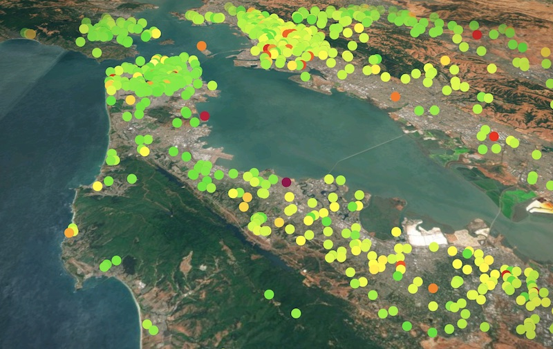

# Air Quality Visualizations
2D and 3D visualization of air quality sensor data.

[Live 3D demo with real-time sensor data](https://olwal.github.io/air/3d/)

Visualization of sensor data from [PurpleAir](https://purpleair.com/), leveraging [p5.js](https://p5js.org/), [procedural-gl.js](https://github.com/felixpalmer/procedural-gl-js) and [Altair](https://altair-viz.github.io/).

