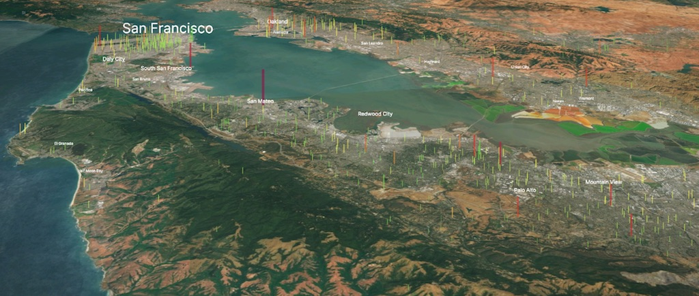
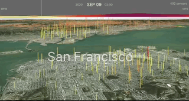
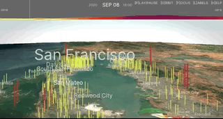
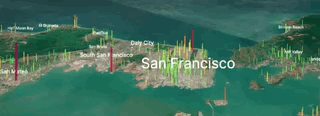

# Interactive Air Quality in 3D | 2020: Air Quality Year in Review
This project visualizes air quality data overlaid onto a 3D geographical map. The map shows hourly data from thousands of sensors and allows interaction and playback of air quality pattern across various locations. These visualizations particularly highlight the significant impact that the 2020 Bay Area fires had on air quality, but can be used to explore patterns throughout the full year. 

Tested platforms:
- iOS (iPhone/iPad): Tested with Firefox, Chrome and Safari. 
- macOS/Windows: Tested with Firefox, Chrome and Safari. 
- Android: Tested with Firefox and Chrome. (clicking on city label not currently supported)

Use the menu to select a city, radius for the area to show sensors, and date range. Given the potential large amount of sensor data at a specific location/radius, the interface does not dynamically load new data as the map is panned. However, one can click a different city directly to load new data. 

[Live 3D demo with time-series sensor data](https://olwal.github.io/air/3d/)

 

The application allows specification of location in California, start and end dates and other parameters for the visualization. (see URL parameters, below, for full list)

The animated 3D visualizations are based on sensor data from [PurpleAir](https://purpleair.com/), leveraging JavaScript, [procedural-gl.js](https://github.com/felixpalmer/procedural-gl-js) and [p5.js](https://p5js.org/). Data files preprocessed with Python and [Jupyter Lab](https://jupyter.org/). 

## 2020 Bay Area fires
Real-time 3D visualization of air quality sensor data within a certain radius from the location, references to 3rd party material, and timelapse videos of the 3D visualizations.

### [LNU Lightning Complex Fires](https://olwal.github.io/air/3d?location=LNU%20Lightning%20Complex%20Fires&start_date=2020-08-16&end_date=2020-10-03&radius=50000&distance=50000) | Aug 17 to Oct 02
- Locations: [Napa](https://olwal.github.io/air/3d?location=Napa&start_date=2020-08-16&end_date=2020-10-11&radius=50000&distance=50000), Lake, [Sonoma](https://olwal.github.io/air/3d?location=Sonoma&start_date=2020-08-16&end_date=2020-10-11&radius=25000&distance=50000), [Yolo](https://olwal.github.io/air/3d?location=Yolo&start_date=2020-08-16&end_date=2020-10-11&radius=50000&distance=50000), Solano
- References: [SF Chronicle Fire Tracker](https://www.sfchronicle.com/projects/california-fire-map/2020-lnu-lightning-complex), [InciWeb](https://inciweb.nwcg.gov/incident/7027/), [Wikipedia](https://en.wikipedia.org/wiki/LNU_Lightning_Complex_fires)
- [Napa Video](https://youtu.be/sms1VZ-AS3k)

Interactive demo | Napa | Aug 16-Oct 03: 

### [CZU August Lightning Complex Fires](http://olwal.github.io/air/3d?location=CZU%20Lightning%20Complex%20Fires&start_date=2020-08-16&end_date=2020-09-23&radius=20000&distance=50000) | Aug 17 to Sep 22
- Locations: [Santa Cruz](https://olwal.github.io/air/3d?location=Santa%20Cruz&start_date=2020-08-16&end_date=2020-09-23&radius=20000&distance=30000), [San Mateo](https://olwal.github.io/air/3d?location=San%20Mateo&start_date=2020-08-16&end_date=2020-09-23)
- References: [SF Chronicle Fire Tracker](https://www.sfchronicle.com/projects/california-fire-map/2020-cnu-august-lightning-complex), [InciWeb](https://inciweb.nwcg.gov/incident/7028/), [Wikipedia](https://en.wikipedia.org/wiki/CZU_Lightning_Complex_fires)
- [San Mateo Video](https://youtu.be/mKirhChPaWU)

Interactive demo | Santa Cruz | Aug 16-Sep 23: 

### [SCU August Lightning Complex Fires](http://olwal.github.io/air/3d?location=SCU%20Lightning%20Complex%20Fires&start_date=2020-08-15&end_date=2020-10-03&radius=30000&distance=50000) | Aug 16 to Oct 02
- Locations: [Santa Clara](http://olwal.github.io/air/3d?location=Santa%20Clara&start_date=2020-08-15&end_date=2020-10-03&radius=20000&distance=20000), [Alameda](http://olwal.github.io/air/3d?location=Alameda&start_date=2020-08-15&end_date=2020-10-03&radius=20000&distance=20000), Contra Costa, [San Joaquin](http://olwal.github.io/air/3d?location=San%20Joaquin&start_date=2020-08-15&end_date=2020-10-03&radius=50000&distance=30000), Stanislaus
- References: [SF Chronicle Fire Tracker](https://www.sfchronicle.com/projects/california-fire-map/2020-cnu-august-lightning-complex), [InciWeb](https://inciweb.nwcg.gov/incident/7056/), [Wikipedia](https://en.wikipedia.org/wiki/SCU_Lightning_Complex_fires)
- [Santa Clara Video](https://youtu.be/gJdsuwGUNYg)

Interactive demo | Santa Clara | Aug 15-Oct 03: 

## 2020 | 1-year Time Series
These full-year datasets take quite some time to load.
Firefox seems most stable in loading these.

- [Oakland](https://olwal.github.io/air/3d/?location=Oakland&start_date=2020-01-01&end_date=2021-01-01&radius=20000&distance=20000) | [Timelapse Video](https://youtu.be/jxLtuF0n3hA) (15:29) | 2020 Jan-Dec
- [Santa Cruz](https://olwal.github.io/air/3d/?location=Santa%20Cruz&start_date=2020-01-01&end_date=2021-01-01&radius=20000&distance=30000) | [Timelapse Video](https://youtu.be/fsbrf3rNnMg) (15:40) | 2020 Jan-Dec
- [San Francisco](https://olwal.github.io/air/3d/?location=San%20Francisco&start_date=2020-01-01&end_date=2021-01-01) | [Timelapse Video](https://youtu.be/-bVvzHcI12I) (17:11) | 2020 Jan-Dec

## 3D views

## Input controls

### Navigation
| key     | command       | description                                              |
|---------|---------------|----------------------------------------------------------|
| o ENTER | orbit         | Start orbiting around location, click with mouse to stop |
| f       | focus         | Focus on specific location                               |

### Rendering
| key     | command       | description                                              |
|---------|---------------|----------------------------------------------------------|
| l       | labels        | Show/hide location labels                                |
| g       | graph         | Show/hide graph                                          |

### Playback
| key     | command       | description                                              |
|---------|---------------|----------------------------------------------------------|
| p SPACE | play/pause    | Start/stop playback                                      |
| r       | rewind        | Rewind to beginning                                      |
| x/X     | speed         | Increase/decrease playback speed                         |
| { N <   | 10 back       | Step back 10 frames                                      |
| [ n ,   | 1 back        | Step back 1 frame                                        |
| ] m .   | 1 forward     | Step forward 1 frame                                     |
| } M >   | 10 forward    | Step forward 10 frames                                   |

### Interface
| key     | command       | description                                              |
|---------|---------------|----------------------------------------------------------|
| h       | help          | Show/hide instruction hint                               |
| ESC     | abort loading | Abort loading data, useful when loading large datasets   |

### Mouse motion
| action     | description   |
|---------|---------------|
| Right button + move | Rotate          | 
| Shift + Left button + move | Rotate |
| Left button + move | Pan |
| Center button + move | Zoom |
| Scroll wheel | Zoom |
| Click on location | Load data for the location |
| Click on data point | Focus on that data point |

## URL parameters

| parameter | description                                                                   | example               | default    |
|---------------|---------------------------------------------------------------------------|-----------------------|------------|
| location      | Bay area cities or one of the 3 lightning complex fires (see above).      | location=Santa Cruz   |            |
| longitude     | Longitude for location. Not used if location parameter is specified.      | longitude=-122.08     | -122.4194  |
| latitude      | Latitude for location. Not used if location parameter is specified.       | latitude=37.4         | 37.7749    |
| radius        | Radius (m) of area from the location to load sensor data for.             | radius=10000          | 7500       |
| distance      | Canera distance                                                           | distance=50000        | 20000      |
| start_date    | YYYY-MM-DD for time series start. 2020-01-01 <= start_date <= 2021-01-01. | start_date=2020-10-01 | 2020-08-19 |
| end_date      | YYYY-MM-DD for time series end. 2020-01-01 <= end_date <= 2021-01-01.     | end_date=2020-11-25   | 2020-09-15 |

Examples: 
| description | example |
|-|-|
| San Mateo, Sep 30-Oct 03 | http://olwal.github.io/air/3d?location=San%20Mateo&start_date=2020-09-30&end_date=2020-10-03 |
| Longitude/Latitude (Between Mountain View and Cupertino) with default dates | http://olwal.github.io/air/3d?longitude=-122.08&latitude=37.35 |
| Default location and dates, but 20 km radius | http://olwal.github.io/air/3d?radius=20000 |
| Alameda, Aug 15-Oct 03, 20 km radius, 30 km camera distance | http://olwal.github.io/air/3d?location=Alameda&start_date=2020-08-15&end_date=2020-10-03&radius=20000&distance=30000 |

## Acknowledgments
Many thanks to Oskar Rönnberg, Carsten Schwesig, and Sebastian Rinnebach for insightful feedback on the interface and features. Special thanks to Felix Palmer for providing the open sourced procedural-gl.js library. 
